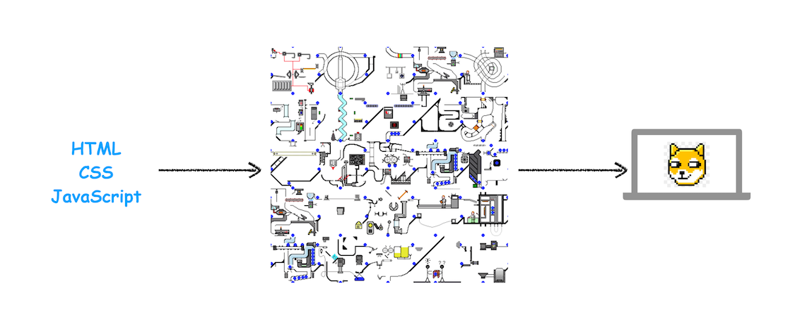
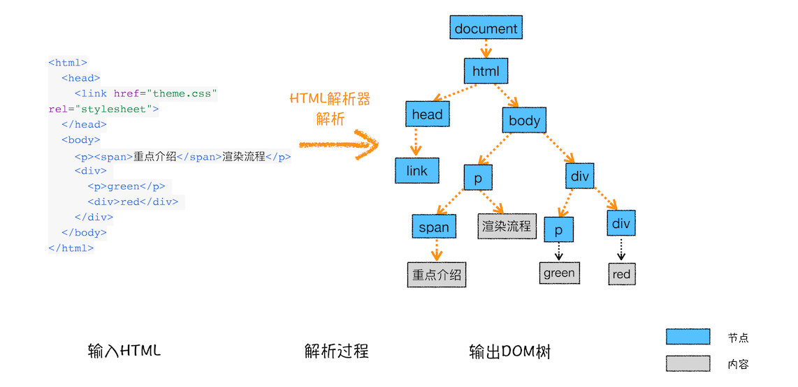
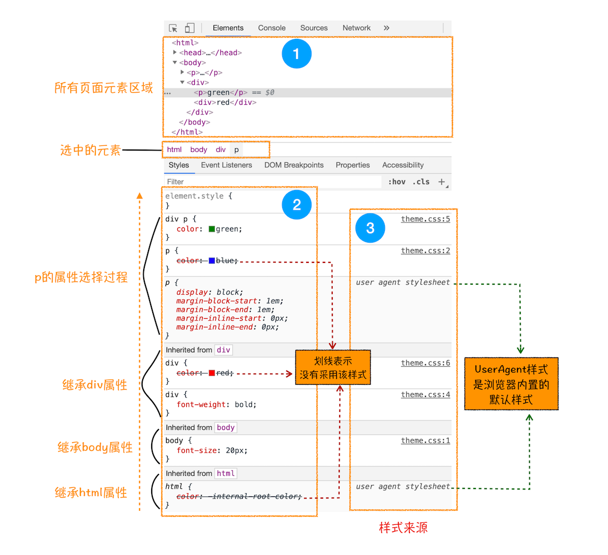

## 页面渲染机制 <!-- {docsify-ignore} -->

### 页面渲染机制图



上图反映了从左边的 HTML、Javascript、CSS 文件经过中间的渲染处理，最终生成呈现在用户面前的网页的一个过程，毫无疑问，我们今天的主题就是探究中间的那个渲染处理的过程，也就是我们的页面渲染机制。
首先我们对以下有个概念的了解：

- 1、HTML 是超文本标记语言，主要由标签和文本组成，反映网页的一个结构：

```Html
    <div>
        <span>name:</span>
        <input value="haoxin" />
    </div>
```

- 2、CSS 层叠样式 管理页面的外表是否好看

- 3、Javascript 脚本，管理页面行为，跟 Html 通过 DOM API 来沟通，跟 CSS 通过 style sheet api 来管理

由于渲染过程过于复杂，我们又可以将其看做是一个流水线，并把整个阶段分为多个子阶段：

- 1、构建 DOM 树

- 2、样式计算

- 3、布局阶段

- 4、分层

- 5、绘制

- 6、分块

- 7、光栅化和合成

上面每个阶段都有共同点：

- 每个阶段都有输入内容
- 每个阶段都有其处理过程
- 每个阶段都有输出内容

### 构建 DOM 树

为什么要构建 DOM 树？因为浏览器不能直接理解和使用 HTML，所以要将 HTML 转换成能理解的 DOM 树。具体如下图：

上图表示一个 html 文件通过 HTML parser 的解析最终生成一棵 DOM 树
你也可以用浏览器开发者工具，Console 标签栏，输入 document 将会为你展示完整的 dom 内容。

dom 与 html 结构上是一致的，不一样的是 dom 是保存在内存中的，可以通过 javascript 来修改其内容。

### 样式计算

生成了 DOM 只是有了最基本的页面结构，为了好看，还有为 dom 添加样式

- 1、把 CSS 解析为浏览器能理解的结构
  CSS 的来源主要有三种方式：通过 link 引用外部文件、通过 style 标签内联样式、通过元素的行内样式
  同浏览器无法直接理解 html 一样，浏览器也无法直接理解 css 样式，所以渲染引擎在接收到 css 样式时会将其转换成 styleSheets,可以在浏览器开发者工具中通过 document.styleSheets 来查看，这个结构也可以供 js 查询和修改

- 2、转换样式表的属性，使其标准化
  什么是属性标准化?来看看：

```CSS
    body { font-size: 2em }
    p {color:blue;}
    span {display: none}
    div {font-weight: bold}
    div p {color:green;}
    div {color:red; }
```

上面的样式的属性值比如：2em、blue、green、red 这些属性值是不容易被浏览器所理解的，所以要将其转换成浏览器所能理解的、标准化的值，这个过程就是样式的标准化，上述代码转换后的样式如下：

```CSS
    body { font-size: 32px }
    p {color:rgba(0,0,255);}
    span {display: none}
    div {font-weight: 700}
    div p {color:rgba(0,128,0);}
    div {color:rgba(255,0,0); }
```

- 3、计算每个 dom 节点的具体样式
  这个就涉及到了样式的继承和层叠规则了,这个阶段输出的是每个 dom 节点通过继承和层叠规则的计算后的样式，并保存在 ComputedStyle 的结构内。
  

### 布局阶段

经过上上面我们得到了 DOM 树和样式结构 StyleSheets，但这个还不足以显示出画面，因为 Dom 节点在页面上的几何结构还不能确定，这个就需要布局。
Chrome 在这个阶段主要有两个步骤：

- 1、构建布局树
  基于 DOM 树和样式结构构建一棵只有可见元素的布局树，不包括 head 标签、去除 display:none 的标签

- 2、布局计算
  有了布局树后就要计算布局树节点的坐标信息了。

### 分层

通过生成布局树，我们有了每个节点的位置信息，这个时候是不是可以直接绘制页面了？答案是否定的，因为页面中有很多复杂的效果，比如复杂的 3d 变换、页面滚动、用 z-indexing 来做 z 轴排序等，为了更方便实现这些效果，渲染引擎还需求为特定节点生成专用的图层，并生成一棵对应的图层树(LayerTree)。这些图层按一定顺序叠在一起就形成最终的页面。
通常情况下，布局树上每个节点都包含一个图层，如果一个节点不包含图层，它便包含在父节点的图层上，在这个角度来看，一个节点都直接或间接从属于一个图层。那么浏览器在什么条件下会为一个节点创建一个新的图层呢？

- 1、拥有层叠上下文属性的元素会被提升为单独的一层

```
    1、根元素html
    2、position 值为 absolute（绝对定位）或  relative（相对定位）且 z-index 值不为 auto 的元素；
    3、position 值为 fixed（固定定位）或 sticky（粘滞定位）的元素（沾滞定位适配所有移动设备上的浏览器，但老的桌面浏览器不支持）；
    4、flex (flexbox (en-US)) 容器的子元素，且 z-index 值不为 auto；
    5、grid (grid) 容器的子元素，且 z-index 值不为 auto；
    6、opacity 属性值小于 1 的元素（参见 the specification for opacity）；
    7、mix-blend-mode 属性值不为 normal 的元素；
    8、以下任意属性值不为 none 的元素：
    transform
    filter
    perspective
    clip-path
    mask / mask-image / mask-border
    9、isolation 属性值为 isolate 的元素；
    10、webkit-overflow-scrolling 属性值为 touch 的元素；
    11、will-change 值设定了任一属性而该属性在 non-initial 值时会创建层叠上下文的元素（参考这篇文章）；
    12、contain 属性值为 layout、paint 或包含它们其中之一的合成值（比如 contain: strict、contain: content）的元素。
```

- 2、需要被剪裁的地方也会被创建图层

### 从渲染机制原理如何去做优化

- 1、问题：
  如果 CSS 文件下载阻塞了，会阻碍 DOM 树的构建吗？会阻塞页面的展示吗？

  当从服务器接收 HTML 页面的第一批数据时，DOM 解析器就开始工作了，在解析过程中，如果遇到了 JS 脚本，如下所示：
  <html>
      <body>
          极客时间
          <script>
          document.write("--foo")
          </script>
      </body>
  </html>
  那么DOM解析器会先执行JavaScript脚本，执行完成之后，再继续往下解析。

那么第二种情况复杂点了，我们内联的脚本替换成 js 外部文件，如下所示：

<html>
    <body>
        极客时间
        <script type="text/javascript" src="foo.js"></script>
    </body>
</html>
这种情况下，当解析到JavaScript的时候，会先暂停DOM解析，并下载foo.js文件，下载完成之后执行该段JS文件，然后再继续往下解析DOM。这就是JavaScript文件为什么会阻塞DOM渲染。

我们再看第三种情况，还是看下面代码：

<html>
    <head>
        <style type="text/css" src = "theme.css" />
    </head>
    <body>
        <p>极客时间</p>
        <script>
            let e = document.getElementsByTagName('p')[0]
            e.style.color = 'blue'
        </script>
    </body>
</html>
当我在JavaScript中访问了某个元素的样式，那么这时候就需要等待这个样式被下载完成才能继续往下执行，所以在这种情况下，CSS也会阻塞DOM的解析。
