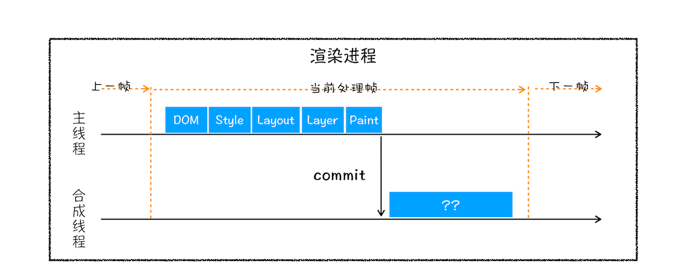
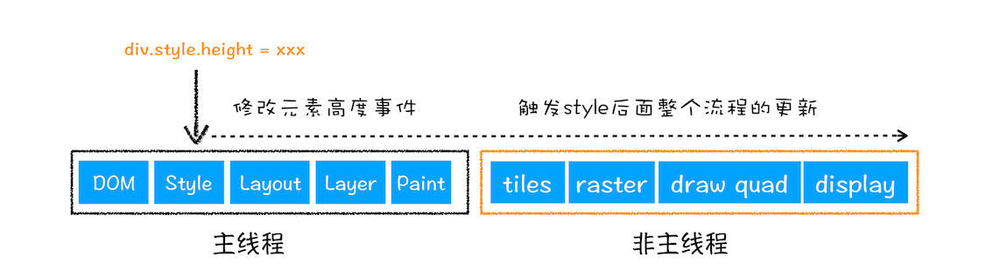

## 页面渲染机制 <!-- {docsify-ignore} -->

### 页面渲染机制图


上图反映了从左边的 HTML、Javascript、CSS 文件经过中间的渲染处理，最终生成呈现在用户面前的网页的一个过程，毫无疑问，我们今天的主题就是探究中间的那个渲染处理的过程，也就是我们的页面渲染机制。
首先我们对以下有个概念的了解：

- 1、HTML 是超文本标记语言，主要由标签和文本组成，反映网页的一个结构：

```Html
    <div>
        <span>name:</span>
        <input value="haoxin" />
    </div>
```

- 2、CSS 层叠样式 管理页面的外表是否好看

- 3、Javascript 脚本，管理页面行为，跟 Html 通过 DOM API 来沟通，跟 CSS 通过 style sheet api 来管理

由于渲染过程过于复杂，我们又可以将其看做是一个流水线，并把整个阶段分为多个子阶段：

- 1、构建 DOM 树

- 2、样式计算

- 3、布局阶段

- 4、分层

- 5、绘制

- 6、分块

- 7、光栅化和合成

上面每个阶段都有共同点：

- 每个阶段都有输入内容
- 每个阶段都有其处理过程
- 每个阶段都有输出内容

### 构建 DOM 树

为什么要构建 DOM 树？因为浏览器不能直接理解和使用 HTML，所以要将 HTML 转换成能理解的 DOM 树。具体如下图：

上图表示一个 html 文件通过 HTML parser 的解析最终生成一棵 DOM 树
你也可以用浏览器开发者工具，Console 标签栏，输入 document 将会为你展示完整的 dom 内容。

dom 与 html 结构上是一致的，不一样的是 dom 是保存在内存中的，可以通过 javascript 来修改其内容。

### 样式计算

生成了 DOM 只是有了最基本的页面结构，为了好看，还有为 dom 添加样式

- 1、把 CSS 解析为浏览器能理解的结构
  CSS 的来源主要有三种方式：通过 link 引用外部文件、通过 style 标签内联样式、通过元素的行内样式
  同浏览器无法直接理解 html 一样，浏览器也无法直接理解 css 样式，所以渲染引擎在接收到 css 样式时会将其转换成 styleSheets,可以在浏览器开发者工具中通过 document.styleSheets 来查看，这个结构也可以供 js 查询和修改

- 2、转换样式表的属性，使其标准化
  什么是属性标准化?来看看：

```CSS
    body { font-size: 2em }
    p {color:blue;}
    span {display: none}
    div {font-weight: bold}
    div p {color:green;}
    div {color:red; }
```

上面的样式的属性值比如：2em、blue、green、red 这些属性值是不容易被浏览器所理解的，所以要将其转换成浏览器所能理解的、标准化的值，这个过程就是样式的标准化，上述代码转换后的样式如下：

```CSS
    body { font-size: 32px }
    p {color:rgba(0,0,255);}
    span {display: none}
    div {font-weight: 700}
    div p {color:rgba(0,128,0);}
    div {color:rgba(255,0,0); }
```

- 3、计算每个 dom 节点的具体样式
  这个就涉及到了样式的继承和层叠规则了,这个阶段输出的是每个 dom 节点通过继承和层叠规则的计算后的样式，并保存在 ComputedStyle 的结构内。
  

### 布局阶段

经过上上面我们得到了 DOM 树和样式结构 StyleSheets，但这个还不足以显示出画面，因为 Dom 节点在页面上的几何结构还不能确定，这个就需要布局。
Chrome 在这个阶段主要有两个步骤：

- 1、构建布局树
  基于 DOM 树和样式结构构建一棵只有可见元素的布局树，不包括 head 标签、去除 display:none 的标签

- 2、布局计算
  有了布局树后就要计算布局树节点的坐标信息了。

### 分层

通过生成布局树，我们有了每个节点的位置信息，这个时候是不是可以直接绘制页面了？答案是否定的，因为页面中有很多复杂的效果，比如复杂的 3d 变换、页面滚动、用 z-indexing 来做 z 轴排序等，为了更方便实现这些效果，渲染引擎还需求为特定节点生成专用的图层，并生成一棵对应的图层树(LayerTree)。这些图层按一定顺序叠在一起就形成最终的页面。
通常情况下，布局树上每个节点都包含一个图层，如果一个节点不包含图层，它便包含在父节点的图层上，在这个角度来看，一个节点都直接或间接从属于一个图层。那么浏览器在什么条件下会为一个节点创建一个新的图层呢？

- 1、拥有层叠上下文属性的元素会被提升为单独的一层

```
    1、根元素html
    2、position 值为 absolute（绝对定位）或  relative（相对定位）且 z-index 值不为 auto 的元素；
    3、position 值为 fixed（固定定位）或 sticky（粘滞定位）的元素（沾滞定位适配所有移动设备上的浏览器，但老的桌面浏览器不支持）；
    4、flex (flexbox (en-US)) 容器的子元素，且 z-index 值不为 auto；
    5、grid (grid) 容器的子元素，且 z-index 值不为 auto；
    6、opacity 属性值小于 1 的元素（参见 the specification for opacity）；
    7、mix-blend-mode 属性值不为 normal 的元素；
    8、以下任意属性值不为 none 的元素：
    transform
    filter
    perspective
    clip-path
    mask / mask-image / mask-border
    9、isolation 属性值为 isolate 的元素；
    10、webkit-overflow-scrolling 属性值为 touch 的元素；
    11、will-change 值设定了任一属性而该属性在 non-initial 值时会创建层叠上下文的元素（参考这篇文章）；
    12、contain 属性值为 layout、paint 或包含它们其中之一的合成值（比如 contain: strict、contain: content）的元素。
```

- 2、需要被剪裁的地方也会被创建图层

### 绘制

完成了图层树的构建后，渲染引擎会对图层树的每个图层进行绘制。
首先渲染引擎会将一个图层的绘制分成很多个小的绘制指令，然后将这些指令按照顺序组成绘制列表


### 栅格化操作

绘制列表只是用来记录绘制顺序和绘制指令的列表，而实际上绘制操作是由渲染引擎中的合成线程来完成的。你可以结合下图来看下渲染主线程和合成线程之间的关系：


合成线程根据视口(用户在浏览器上的可见区域)将图层划为图块(通常大小为 256 X 256 或 512 X 512)，然后合成线程会按照视口附近的图块来优先生成位图，实际生成位图的操作是由栅格化来执行的。所谓栅格化，是指将图块转换为位图。而图块是栅格化执行的最小单位。渲染进程维护了一个栅格化的线程池，所有的图块栅格化都是在线程池内执行的。通常栅格化操作都是 GPU 内加速生成的，生成的位图被保存在 GPU 中。

### 合成和显示

一旦所有图块都被光栅化，合成线程就会生成一个绘制图块的命令——“DrawQuad”，然后将该命令提交给浏览器进程。浏览器进程里面有一个叫 viz 的组件，用来接收合成线程发过来的 DrawQuad 命令，然后根据 DrawQuad 命令，将其页面内容绘制到内存中，最后再将内存显示在屏幕上。

最后一个完整的浏览器渲染流水线过程如下：


### 渲染机制原理问题及优化

- 1、问题：
  如果 CSS 文件下载阻塞了，会阻碍 DOM 树的构建吗？会阻塞页面的展示吗？

  当从服务器接收 HTML 页面的第一批数据时，DOM 解析器就开始工作了，在解析过程中，如果遇到了 JS 脚本，如下所示：

```Html
  <html>
      <body>
          极客时间
          <script>
          document.write("--foo")
          </script>
      </body>
  </html>
```

那么 DOM 解析器会先执行 JavaScript 脚本，执行完成之后，再继续往下解析。

那么第二种情况复杂点了，我们内联的脚本替换成 js 外部文件，如下所示：

```Html
<html>
    <body>
        极客时间
        <script type="text/javascript" src="foo.js"></script>
    </body>
</html>
```

这种情况下，当解析到 JavaScript 的时候，会先暂停 DOM 解析，并下载 foo.js 文件，下载完成之后执行该段 JS 文件，然后再继续往下解析 DOM。这就是 JavaScript 文件为什么会阻塞 DOM 渲染。

我们再看第三种情况，还是看下面代码：

```Html
    <html>
        <head>
            <style type="text/css" src = "theme.css" />
        </head>
        <body>
            <p>极客时间</p>
            <script>
                let e = document.getElementsByTagName('p')[0]
                e.style.color = 'blue'
            </script>
        </body>
    </html>
```

当我在 JavaScript 中访问了某个元素的样式，那么这时候就需要等待这个样式被下载完成才能继续往下执行，所以在这种情况下，CSS 也会阻塞 DOM 的解析。

- 2、重排、重绘、合成

更改了元素的几何属性（重排）



从上图可以看出来，如果通过 js 或直接修改了样式表某个元素的几何样式（宽度、高度、margin、padding 等）浏览器会触发重新布局，解析之后的一些列子阶段，这个过程叫重排，毫无疑问重排几乎执行了一遍完整的浏览器渲染流水线，代价也是最大的。

更改元素的绘制属性(重绘)


从上图看出，如果改变元素的背景颜色，那么布局阶段不会执行，因为几何位置并没有发生改变，而是执行绘制之后的阶段。相对于重排而言，省去了布局和分层阶段，执行效率会更高。

直接合成阶段

假如我们修改的元素的样式无需重新布局和绘制，像修改元素的 transform 属性，会直接运行合成阶段，这种相对前面两种方式效率最高，大大提高绘制效率

具体减少重排重绘操作：
1、避免使用 table 布局
2、利用 will-change: transform 等手段将复杂动画分层
3、对 dom 节点 style 操作要读写分离
4、对频繁触发的系统事件要节流比如 onresize，mouse 滚动事件
5、对 dom 操作可以利用 DocumentFragment

- 3、介绍一下帧率
  其实浏览器页面上的展示原理和电影差不多，通常电影的帧速是 24，也就是每秒切换 24 幅画面，每幅画面就是一帧，这样人的眼睛就不会感觉出有卡顿。
  目前大多数的浏览器的帧率是 60FPS，也就是 1 秒刷新 60 帧每秒。因此如果一个页面中有动画或者一个渐变效果、用户正在滚动页面，那么浏览器渲染页面的频率至少要和刷新频率保持一致，就是每帧只有 16ms 的时间。如果超过 16 秒就会感觉到页面的抖动。所以想要保证页面的流畅，就要降低每帧的渲染时间。
