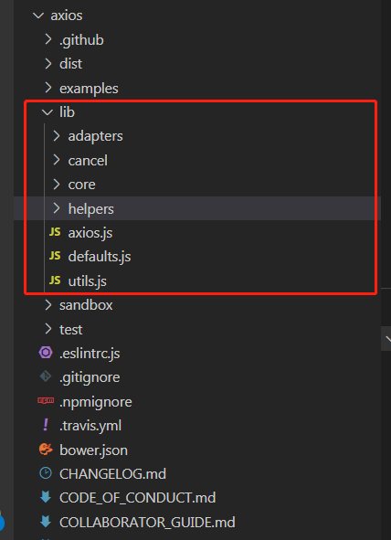
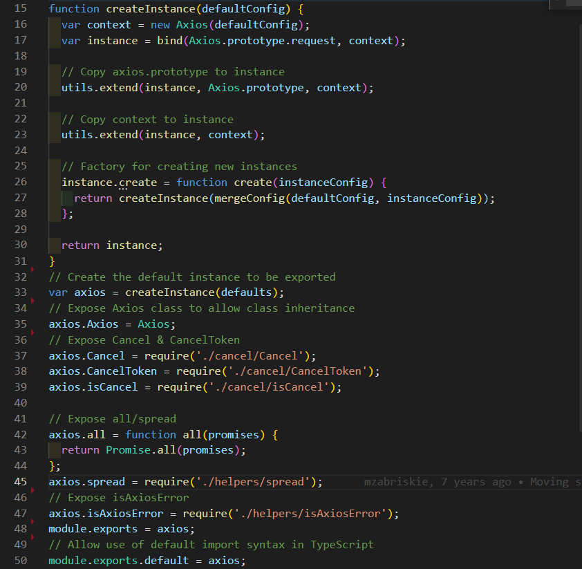
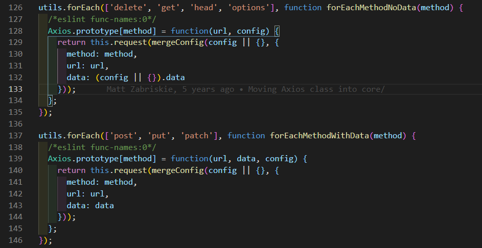
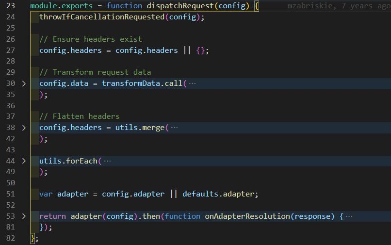

# 关于 Axios 使用与源码学习

## 介绍

Axios 是一个基于 Promise API 的，可用于浏览器和 Node 端的 HTTP 库。

- 从浏览器创建 XMLHttpRequest
- 从 Node 创建 http.request
- 基于 Promise API
- 设置拦截器拦截请求和响应
- 在处理请求和响应前装换数据
- 取消请求
- 自动装换 JSON 数据
- 客户端支持防御 XSRF

## 安装

使用 npm：

```Javascript
    npm i axios -S
```

使用 CDN：

```Javascript
    <script src="https://unpkg.com/axios/dist/axios.min.js"></script>

```

## 使用

- 因为导出的 axios 作为一个包装 Axios 实例的一个函数,可用直接通过传入请求参数调用 axios ：

```Javascript
    const axios=require('axios');
    axios({

    }).then(res=>{

    }).catch(err=>{

    });
    //或
    axios(url,{

    }).then(res=>{

    }).catch(err=>{

    })
```

- 可用基于 axios 对象上 extend 的请求方法调用

```Javascript
    const axios=require('axios');
    axios.get(url,options).then(res=>{});
    axios.post(url,{}).then(res=>{})
```

- 直接使用 axios.request()方法调用，request 是 Axios 上的原型方法，也是其他所有封装方法的底层：

```Javascript
    const axios=require('axios');
    axios.request({

    })
    //或
    axios.request(url,{})
```

- 执行并发请求：

```Javascript
    const axios=require('axios');
    function getUserList(params){
        return axios.get(params.url);
    }
    function getUserAccount(params){
        return axios.get(params.url)
    }
    axios.all([getUserList(),getUserAccount()]).then(function(result){
        const userList=result[0];
        const userAccount=result[1];
        ...
    })
```

- 利用 axios 提供的 create 方法，创建实例（本质返回的还是基于 Axios 实例的包装函数）,可以基于该实例调用各种请求方法：

```Javascript
    const axios=require('axios');
    const instance=axios.create(selfConfig);
    instance.get({});
    instance.post({});
```

设置拦截器：

```Javascript
    const axios=require('axios');
    //设置请求前的拦截器，对config进行修改并返回config
    axios.interceptors.request.use(function(config){
        ...
        return config;
    })
    //设置响应后的拦截器，对响应内容进行修改并返回
    axios.interceptors.response.use(function(response){
        ...
        return response;
    })
```

修改默认配置：
axios 库本身内置了一部分 config，比如通用的 http 首部字段:Accept,可以通过：

```Javascript
    const axios=require('axios');
    axios.defaults.headers.common['Accept']="text/plain";
```

贴上请求的配置项，在项目应用中可以根据实际进行修改：

```Javascript
{
   // `url` 是用于请求的服务器 URL
  url: '/user',

  // `method` 是创建请求时使用的方法
  method: 'get', // default

  // `baseURL` 将自动加在 `url` 前面，除非 `url` 是一个绝对 URL。
  // 它可以通过设置一个 `baseURL` 便于为 axios 实例的方法传递相对 URL
  baseURL: 'https://some-domain.com/api/',

  // `transformRequest` 允许在向服务器发送前，修改请求数据
  // 只能用在 'PUT', 'POST' 和 'PATCH' 这几个请求方法
  // 后面数组中的函数必须返回一个字符串，或 ArrayBuffer，或 Stream
  transformRequest: [function (data, headers) {
    // 对 data 进行任意转换处理
    return data;
  }],

  // `transformResponse` 在传递给 then/catch 前，允许修改响应数据
  transformResponse: [function (data) {
    // 对 data 进行任意转换处理
    return data;
  }],

  // `headers` 是即将被发送的自定义请求头
  headers: {'X-Requested-With': 'XMLHttpRequest'},

  // `params` 是即将与请求一起发送的 URL 参数
  // 必须是一个无格式对象(plain object)或 URLSearchParams 对象
  params: {
    ID: 12345
  },

   // `paramsSerializer` 是一个负责 `params` 序列化的函数
  // (e.g. https://www.npmjs.com/package/qs, http://api.jquery.com/jquery.param/)
  paramsSerializer: function(params) {
    return Qs.stringify(params, {arrayFormat: 'brackets'})
  },

  // `data` 是作为请求主体被发送的数据
  // 只适用于这些请求方法 'PUT', 'POST', 和 'PATCH'
  // 在没有设置 `transformRequest` 时，必须是以下类型之一：
  // - string, plain object, ArrayBuffer, ArrayBufferView, URLSearchParams
  // - 浏览器专属：FormData, File, Blob
  // - Node 专属： Stream
  data: {
    firstName: 'Fred'
  },

  // `timeout` 指定请求超时的毫秒数(0 表示无超时时间)
  // 如果请求话费了超过 `timeout` 的时间，请求将被中断
  timeout: 1000,

   // `withCredentials` 表示跨域请求时是否需要使用凭证
  withCredentials: false, // default

  // `adapter` 允许自定义处理请求，以使测试更轻松
  // 返回一个 promise 并应用一个有效的响应 (查阅 [response docs](#response-api)).
  adapter: function (config) {
    /* ... */
  },

 // `auth` 表示应该使用 HTTP 基础验证，并提供凭据
  // 这将设置一个 `Authorization` 头，覆写掉现有的任意使用 `headers` 设置的自定义 `Authorization`头
  auth: {
    username: 'janedoe',
    password: 's00pers3cret'
  },

   // `responseType` 表示服务器响应的数据类型，可以是 'arraybuffer', 'blob', 'document', 'json', 'text', 'stream'
  responseType: 'json', // default

  // `responseEncoding` indicates encoding to use for decoding responses
  // Note: Ignored for `responseType` of 'stream' or client-side requests
  responseEncoding: 'utf8', // default

   // `xsrfCookieName` 是用作 xsrf token 的值的cookie的名称
  xsrfCookieName: 'XSRF-TOKEN', // default

  // `xsrfHeaderName` is the name of the http header that carries the xsrf token value
  xsrfHeaderName: 'X-XSRF-TOKEN', // default

   // `onUploadProgress` 允许为上传处理进度事件
  onUploadProgress: function (progressEvent) {
    // Do whatever you want with the native progress event
  },

  // `onDownloadProgress` 允许为下载处理进度事件
  onDownloadProgress: function (progressEvent) {
    // 对原生进度事件的处理
  },

   // `maxContentLength` 定义允许的响应内容的最大尺寸
  maxContentLength: 2000,

  // `validateStatus` 定义对于给定的HTTP 响应状态码是 resolve 或 reject  promise 。如果 `validateStatus` 返回 `true` (或者设置为 `null` 或 `undefined`)，promise 将被 resolve; 否则，promise 将被 rejecte
  validateStatus: function (status) {
    return status >= 200 && status < 300; // default
  },

  // `maxRedirects` 定义在 node.js 中 follow 的最大重定向数目
  // 如果设置为0，将不会 follow 任何重定向
  maxRedirects: 5, // default

  // `socketPath` defines a UNIX Socket to be used in node.js.
  // e.g. '/var/run/docker.sock' to send requests to the docker daemon.
  // Only either `socketPath` or `proxy` can be specified.
  // If both are specified, `socketPath` is used.
  socketPath: null, // default

  // `httpAgent` 和 `httpsAgent` 分别在 node.js 中用于定义在执行 http 和 https 时使用的自定义代理。允许像这样配置选项：
  // `keepAlive` 默认没有启用
  httpAgent: new http.Agent({ keepAlive: true }),
  httpsAgent: new https.Agent({ keepAlive: true }),

  // 'proxy' 定义代理服务器的主机名称和端口
  // `auth` 表示 HTTP 基础验证应当用于连接代理，并提供凭据
  // 这将会设置一个 `Proxy-Authorization` 头，覆写掉已有的通过使用 `header` 设置的自定义 `Proxy-Authorization` 头。
  proxy: {
    host: '127.0.0.1',
    port: 9000,
    auth: {
      username: 'mikeymike',
      password: 'rapunz3l'
    }
  },

  // `cancelToken` 指定用于取消请求的 cancel token
  // （查看后面的 Cancellation 这节了解更多）
  cancelToken: new CancelToken(function (cancel) {
  })
}
```

## 源码

在了解 axios 的特性和使用后（无论是什么库，在看源码之前建议务必了解库本身的特性和如何使用，这样我们在阅读的时候才不至于被细节困扰），我们现在正式进入源码的学习
另外，因为 axios 只是根据宿主环境分别对浏览器的 XMLHttpRequest 和 Node 的 http 模块的 request 进行封装，涉及到具体的知识点，可以翻翻上面的 xhr 和 http.request 复习相关知识点。

### 代码结构

从 github 把代码 clone 下来到本地后，打开代码目录，可以发现源码主要在 lib 文件夹下，如图：


- adapters 文件夹 主要是适配器，浏览器下是 XMLHttpRequest，而在 Node 下是 http 模块的 request,可以通过修改配置项的 adapter 自定义请求
- cancel 文件夹是取消请求的相关文件
- core 文件夹 是库的核心，主要包括 Axios 类、拦截器类、mergeConfig 工具等
- helpers 文件夹主要提供 Http 首部字段处理、url 处理、校验等辅助方法
- axios.js 是入口文件，导出变量、并基于 Axios 进一步封装、扩展
- default.js 是初始化 Axios 实例默认的配置项
- utils.js 提供一些基础的方法，比如数据类型的判断、封装 forEach 等

### 入口文件

我们先看看 lib/axios.js,在 package.json 中 main 字段定义库的入口为 index.js，但由于在 index.js 中仅有一行代码 require('./lib/axios.js') 引用了 axios.js,故这里称 axios.js 为入口文件，真正涉及到源码的地方：


看上述代码很明显的，用 CJS 模块语法导出了一个 axios 对象，为了兼容 TypeScript，还具名 default 做了兼容。我们看得出来，axios 对象上是挂载了 all、spread 等方法，也挂载了 CancelToken、Cancel、isCancel 这些属性，为用户提供了快捷的方法使用（其实它们都是函数的类方法）

我们在使用 axios 时或许都有点疑问？为什么 axios 的使用如此灵活？可以直接调用 axios 函数、可以创建实例、甚至能通过 axios 调用方法来，下面我们直接看看 createInstance 这个方法，为了方便，我直接拷贝过来：

```Javascript
var defaults = require('./defaults');

/**
 * Create an instance of Axios
 *
 * @param {Object} defaultConfig The default config for the instance
 * @return {Axios} A new instance of Axios
 */
function createInstance(defaultConfig) {
  var context = new Axios(defaultConfig);
  var instance = bind(Axios.prototype.request, context);

  // Copy axios.prototype to instance
  utils.extend(instance, Axios.prototype, context);

  // Copy context to instance
  utils.extend(instance, context);

  // Factory for creating new instances
  instance.create = function create(instanceConfig) {
    return createInstance(mergeConfig(defaultConfig, instanceConfig));
  };

  return instance;
}
// Create the default instance to be exported
var axios = createInstance(defaults);
```

导出的 axios 其实是调用 createInstance() 返回的结果，参数是库内置的默认参数。我们看看 createInstance 函数里干了些啥：

- 1、用默认参数实例化一个 Axios 对象
- 2、通过 bind 方法对 Axios 的原型方法 request 绑定步骤 1 的实例对象作为其执行上下文并返回一个新的函数(划重点)，这个新函数也是 createInstance 的返回结果，这也是为啥能通过 axios()如此调用的原因，因为 axios 本来就是一个函数（本质上是 Axios.prototype.request,只是绑定了 Axios 实例），为了方便描述，我们将其成为包装方法。
- 3、通过 extend 方法来扩展 Axios 的原型方法到包装方法上去，相当于函数对象的类方法，这样就可以通过类似 axios.get()这样来调用了
- 4、往包装函数添加 create 的工厂函数，接收用户定义的配置参数，返回的还是 createInstance 的结果，这样就可以通过 axios.create()方法来创建实例对象了

### 核心

我们看看 lib/core 下的 Axios：
这个文件比较简单，就是通过原型继承的方式来定义 Axios 类，包含两个实例属性 defaults 和 interceptors，分别用来保存配置和拦截器
还有定义了一系列的原型方法，

```Javascript
    //下面非源码，只是方便罗列出来
    Axios.prototype={
        request:function,
        get:function,
        post:function,
        put:function,
        ...
    }
```

其中最最重要的一个原型方法就要数 request 了,上面说的入口文件返回的包装函数实质上就是这个 request 函数,而且以 Http 动作衍生出来的其他原型方法就是以 request 为基础，只是对 url、data 做了一些包装：



```Javascript
//接收额外的自定义配置参数
Axios.prototype.request = function request(config) {
  /*eslint no-param-reassign:0*/
  // Allow for axios('example/url'[, config]) a la fetch API
  //兼容第一个参数为url的写法
  if (typeof config === 'string') {
    config = arguments[1] || {};
    config.url = arguments[0];
  } else {
    config = config || {};
  }
  //合并自定义参数和默认参数
  config = mergeConfig(this.defaults, config);

  // Set config.method
  if (config.method) {
    config.method = config.method.toLowerCase();
  } else if (this.defaults.method) {
    config.method = this.defaults.method.toLowerCase();
  } else {
    config.method = 'get';
  }

  var transitional = config.transitional;

  if (transitional !== undefined) {
    validator.assertOptions(transitional, {
      silentJSONParsing: validators.transitional(validators.boolean, '1.0.0'),
      forcedJSONParsing: validators.transitional(validators.boolean, '1.0.0'),
      clarifyTimeoutError: validators.transitional(validators.boolean, '1.0.0')
    }, false);
  }

  // filter out skipped interceptors
  var requestInterceptorChain = [];
  var synchronousRequestInterceptors = true;
  this.interceptors.request.forEach(function unshiftRequestInterceptors(interceptor) {
    if (typeof interceptor.runWhen === 'function' && interceptor.runWhen(config) === false) {
      return;
    }

    synchronousRequestInterceptors = synchronousRequestInterceptors && interceptor.synchronous;

    requestInterceptorChain.unshift(interceptor.fulfilled, interceptor.rejected);
  });

  var responseInterceptorChain = [];
  this.interceptors.response.forEach(function pushResponseInterceptors(interceptor) {
    responseInterceptorChain.push(interceptor.fulfilled, interceptor.rejected);
  });

  var promise;

  if (!synchronousRequestInterceptors) {
    var chain = [dispatchRequest, undefined];

    Array.prototype.unshift.apply(chain, requestInterceptorChain);
    chain = chain.concat(responseInterceptorChain);

    promise = Promise.resolve(config);
    while (chain.length) {
      promise = promise.then(chain.shift(), chain.shift());
    }

    return promise;
  }


  var newConfig = config;
  while (requestInterceptorChain.length) {
    var onFulfilled = requestInterceptorChain.shift();
    var onRejected = requestInterceptorChain.shift();
    try {
      newConfig = onFulfilled(newConfig);
    } catch (error) {
      onRejected(error);
      break;
    }
  }

  try {
    promise = dispatchRequest(newConfig);
  } catch (error) {
    return Promise.reject(error);
  }

  while (responseInterceptorChain.length) {
    promise = promise.then(responseInterceptorChain.shift(), responseInterceptorChain.shift());
  }

  return promise;
};
```

这个方法主要干了以下事情：

- 1、处理单独传入 url 的情况，并对传入的配置 config 与 defaults 默认配置做合并，
  并且对请求方法做处理

```Javascript
  // 如果第一个参数是字符串，默认取做url
  if (typeof config === 'string') {
    config = arguments[1] || {};
    config.url = arguments[0];
  } else {
    config = config || {};
  }

   config= mergeConfig(this.defaults, config);
     // Set config.method
  if (config.method) {
    config.method = config.method.toLowerCase();
  } else if (this.defaults.method) {
    config.method = this.defaults.method.toLowerCase();
  } else {
    config.method = 'get';
  }
```

- 2、处理请求、响应拦截器函数，这里真的拦截器的 sync 分别做了处理，异步用 promise，很巧妙，可以重点学习一下。

拦截器函数异步，用 PromiseAPI 来处理异步回调

```Javascript
    //相当巧妙
    if (!synchronousRequestInterceptors) {
        //这里注意，下面在promise.then时传的resolve和reject两个函数，所以这里
        //也把undefined加入占位
        var chain = [dispatchRequest, undefined];
        //将拦截器函数依次放入数组保存，顺序为：请求拦截器函数、[dispatchRequest,undefined]、响应拦截器函数
        Array.prototype.unshift.apply(chain, requestInterceptorChain);
        chain = chain.concat(responseInterceptorChain);
        //配置参数依次传入，链式传递处理
        promise = Promise.resolve(config);
        while (chain.length) {
        promise = promise.then(chain.shift(), chain.shift());
        }
        return promise;
   }
```

同步就简单多了

```Javascript
  var newConfig = config;
  while (requestInterceptorChain.length) {
    var onFulfilled = requestInterceptorChain.shift();
    var onRejected = requestInterceptorChain.shift();
    try {
      newConfig = onFulfilled(newConfig);
    } catch (error) {
      onRejected(error);
      break;
    }
  }

  try {
    promise = dispatchRequest(newConfig);
  } catch (error) {
    return Promise.reject(error);
  }

  while (responseInterceptorChain.length) {
    promise = promise.then(responseInterceptorChain.shift(), responseInterceptorChain.shift());
  }

  return promise;
```

分别调用请求拦截器函数(传入相关配置并作为结果返回)、调用 dispatchRequest、响应拦截器函数

上述的 promise 处理利用了 promise.then 方法返回的也是 promise，故可以进行链式调用

可以看出 request 方法中最重要的就是调用了 dispatchRequest 函数，根据宿主环境不同进行请求分发，下面我们来看看 dispatchRequest 函数具体干了些什么：

通过上面的折行代码，我们可以知道在 dispatchRequest 方法中，主要做了以下事情：

- 1、根据 transformRequest 处理请求配置参数
- 2、处理配置参数 config 中的 Headers，并打平 headers 里的 common、各类请求方法的首部到 config.headers
- 3、根据自定义的 adapter 或默认的 adapter 发起请求，并在接下来的回调 then 方法调用 transformResponse 处理响应数据

### 兼容性问题

axios 库依赖原生的 Promise 库，如果版本比较低的浏览器比如 IE6，请用 [polyfill](https://github.com/stefanpenner/es6-promise)
