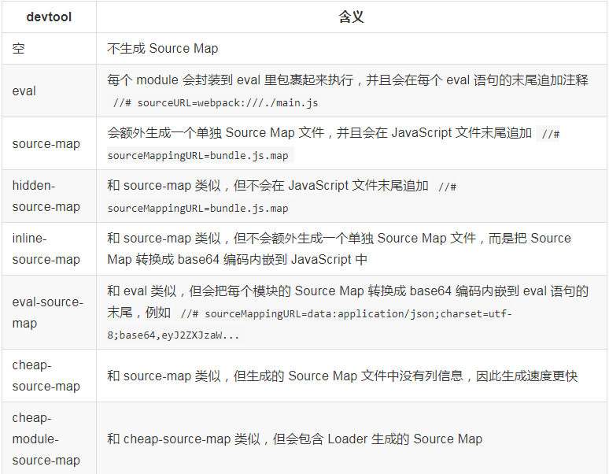

### webpack 加载 Source Map

我们一般会在项目中运用比较新的语法或语法糖，比如 ES6+的语法，但为了兼容不同的浏览器，一般要通过构建工具把这些浏览器没实现的语法规范转换成支持的语法，比如转换成 ES5，这样一来我们的开发效率得到了很大的提供，但经过转换生成的代码可读性极差，很难调试。
webpack 支持对转换生成的代码生成 Source Map 文件，控制 Source Map 文件生成的配置是 devtool,常见的有以下几种：



事实上，devtool 的取值可以由 source-map、eval、inline、hidden、cleap、module 这 6 个关键字随意组合而成。这 6 个关键字每个都代表一种特性，分别是：

- eval:用 eval 语句包裹需要安装的模块。
- source-map：生成独立的 Source Map 文件；
- hidden：不在 Javascript 文件中指出 Source Map 文件所在，这样浏览器不会自动加载 SourceMap 文件；
- inline：吧生成的 Source Map 转换成 base64 格式内嵌在 Javascript 文件中
- cleap：生成的 Source Map 中不会包含列的信息，这样计算量更小，输出的 Source Map 文件更小；同时 Loader 输出的 Source Map 不会被采用
- module：来自 Loader 的 Source Map 被简单处理成每行一个模块。

### 如何选择

source-map 模型下回输出质量最高最详细的 Source Map，但这样会造成构建速度缓慢，特别是开发过程中频繁修改的时候增加等待时间，而且这样会把 source map 暴露出去，构建发布到线上的代码 Source Map 暴露出去等于源码被泄漏。

我们可以在开发环境把 devtool 设置成 cheap-module-eval-source-map，因为生成这种 Source Map 的速度最快，能加速构建。在开发环境下不会做代码压缩，Source Map 中即使没有列信息也不会影响断点调试。

在生产环境下吧 devtool 设置成 hidden-source-map,意思是生成最详细的 Source Map，但不会吧 Source Map 暴露出去。由于在生产环境下会做代码压缩，一个 Javascript 文件只有一行，所以需要列信息。

在生产环境下通常不会把 Source Map 上传到 HTTP 服务器让用户去获取，而是上传到 Javascript 错误收集系统，在错误收集系统上根据 Source Map 和收集到的 Javascript 运行错误堆栈计算出错误所在源码的位置

不要在生产环境使用 inline 模式的 Source Map，因为这会使 Javascript 文件变的很大，而且会泄漏源码。

### 加载现有的 Source Map

有些从 NPM 安装的第三方模块是采用 ES6 或 Typescript 编写的，它们在发布时会同时带上编译出来的 Javascript 文件和对应的 Source Map 文件，方便在出问题的时候调试代码

默认情况下 webpack 是不会去加载这些 Source Map 文件的，Webpack 只会在转换过程中生成 Source Map。为了让 Webpack 加载这些 Source Map 可以安装 source-map-loader

```
    module.exports={
        module:{
            rules:[
                {
                    test:/\.js$/,
                    use:['source-map-loader'],
                    include:path.resolve(__dirname,"node_modules/some-components"),
                    //  要把 source-map-loader 的执行顺序放到最前面，如果在 source-map-loader 之前有 Loader 转换了该 JavaScript 文件，会导致 Source Map 映射错误
                    enforce:"pre",
                }
            ]
        }
    }
```
