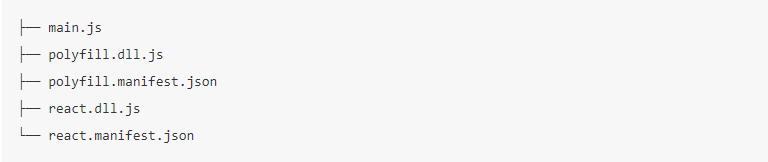

### Webpack 优化

#### 缩小文件搜索范围

webpack 启动后会从 entry 入口文件出发，解析文件中导入语句，再递归解析，在遇到导入语句时，webpack 会做两件事情：

- 1、根据导入语句去找对应要导入的文件比如 require('react')对应的导入文件应该是 node_modules/react/react.js,而 require('./utils.js')对应的文件应该是'./utils.js'
- 2、根据相关配置的 loader 的规则来解析要导入的文件，例如使用 babel-loader 去编译 JS 文件

上面两件事情对一个文件处理是非常快的，但如果文件多了，构建慢的问题就会暴露出来。

解决：

- 1、优化 loader 的配置，因为 loader 的转换操作很耗时，让更小的文件被 loader 处理，可以通过 test、include、exclude 三个配置项来命中 loader 需要处理的文件。

```webpack.config.js
    module.exports={
        module:{
            rules:[
                {
                    test:/\.js$/,
                    use:['babel-loader?cacheDirectory'],
                    //只对根目录下的src文件夹的js文件做babel-loader的转换
                    include:path.resolve(__dirname,"src"),
                }
            ]
        }
    }
```

- 2、优化 resolve.modules 的配置
  该配置项是用来告诉 webpack 如何去找第三方模块的。默认是["node_modules"],含义就是先到当前目录下的 node_modules 文件去找，如果没有就到上一级目录的 node_modules 去找，以此类推，跟 nodejs 的模块查找机制类似。
  当安装的模块都放在根目录./node_modules 下时，没有必要一层层去找，可以指明第三方模块存放的绝对路径，以减少查找：

  ```webpack.config.js
    module.exports={
        resolve:{
            modules:[
                path.resolve(__dirname,"node_modules")
            ]
        }
    }
  ```

  - 3、优化 resolve.mainField 配置
    该配置使用来指定第三方模块的哪个字段用作指定模块入口文件的。每个第三方模块根目录下都有一个 package.json 的项目描述文件，其中有些字段是用来描述模块的入口文件的。可以存在多个字段描述入口文件的原因是因为有些模块可以同时用在多个环境中，针对不同的运行环境需要使用不同的代码。比如 isomorphic-fetch 库为例：

    ```package.json
        {
            "browser": "fetch-npm-browserify.js",
            "main": "fetch-npm-node.js"
        }
    ```

    之所以会这样是因为在浏览器端和 node 端的实现不一样，在浏览器端是基于 fetch 或 XMLHttpRequest 来实现的，而在 node 端是用 http 模块来实现。

    resolve.mainFields 的默认值和 target 的配置有关系：
    当 target 为 web 或者 webworker 时，值是["browser","module","main"],
    当 target 为其他情况时，值是["module","main"],

- 4、优化 resolve.extensions 的配置
  导入语句后没有带后缀时，Webpack 会自动带上后缀去询问文件是否存在。

  ### 使用 DLLPlugin

  我们一般把后缀为.dll 的称作动态链接库，在 Webpack 中，我们可以利用这个做一些优化，要做以下事情：

  - 1、把网页依赖的基础模块抽离出来，打包到一个个单独的动态链接库中去。一个动态链接库中可以包含多个模块。
  - 2、当需要导入的模块存在于某个动态链接库中时，这个模块不能被再次被打包，而是去动态链接库中获取。
  - 3、页面依赖的所有动态链接库需要被加载。

这样会大大提升构建的速度，因为包含大量复用的模块的动态链接库只需要编译一次，在之后的构建过程中，被动态链接库包含的模块将不会重新编译，而是直接用动态链接库的代码。由于动态链接库包含的是常用的第三方模块如：react、react-dom 只有不升级这些模块，动态链接库就不用重新编译。

#### 实现

Webpack 已经内置对动态链接库的支持，主要内置的 2 个插件就可以完成。

- DLLPlugin 插件：用于打包出一个个的动态链接库文件
- DLLReferencePlugin 插件：用于在主要配置文件中去引入 DLLPlugin 插件打包好的动态链接库文件

举个例子，假如有个项目，构建出来的目录如下：


上面包括两个动态链接库，分别是 polyfill.dll.js 里面包含所有项目依赖的 polyfill，如 Promise、fetch 等 API 和 react.dll.js 包含 React 的基础运行环境如 react、react-dom
以 react.dll.js 为例，里面主要是：

```Javascript
    var _dll_react = (function(modules) {
    // ... 此处省略 webpackBootstrap 函数代码
    }([
    function(module, exports, __webpack_require__) {
        // 模块 ID 为 0 的模块对应的代码
    },
    function(module, exports, __webpack_require__) {
        // 模块 ID 为 1 的模块对应的代码
    },
    // ... 此处省略剩下的模块对应的代码
    ]));
```

由此可见一个动态链接库是包括了很多模块代码的，这些模块存在一个数组里，并用 id 作为模块索引。并且通过\_dll_react 变量把自己暴露在全局中。也就是说可以通过 window.\_dll_react 访问到它里面包含的模块。
其中 react.manifest.json 和 polyfill.manifest.json 文件也是有 DLLPlugin 生成，用于描述动态链接库文件中包含哪些模块，已 react.manifest.json 为例：

```
    {
  // 描述该动态链接库文件暴露在全局的变量名称
  "name": "_dll_react",
  "content": {
    "./node_modules/process/browser.js": {
      "id": 0,
      "meta": {}
    },
    // ... 此处省略部分模块
    "./node_modules/react-dom/lib/ReactBrowserEventEmitter.js": {
      "id": 42,
      "meta": {}
    },
    "./node_modules/react/lib/lowPriorityWarning.js": {
      "id": 47,
      "meta": {}
    },
    // ... 此处省略部分模块
    "./node_modules/react-dom/lib/SyntheticTouchEvent.js": {
      "id": 210,
      "meta": {}
    },
    "./node_modules/react-dom/lib/SyntheticTransitionEvent.js": {
      "id": 211,
      "meta": {}
    },
  }
}
```

main.js 是打包出来后应用的入口，当遇到其依赖的模块在 dll.js 文件中时，会直接通过 dll.js 文件暴露出来的全局变量去获取打包在 dll.js 文件的模块。所以在 index.html 文件需要把依赖的两个 dll.js 文件加载进来，index.html 如下：

```index.html
    <html>
    <head>
    <meta charset="UTF-8">
    </head>
    <body>
    <div id="app"></div>
    <!--导入依赖的动态链接库文件-->
    <script src="./dist/polyfill.dll.js"></script>
    <script src="./dist/react.dll.js"></script>
    <!--导入执行入口文件-->
    <script src="./dist/main.js"></script>
    </body>
    </html>
```

那么上面是如何实现的呢？

动态链接库文件相关文件是由一份独立的配置构建出来的，供主构建使用。可以新建一个 webpack 配置文件 webpack.dll.config.js,内容如下：

```
const path = require('path');
const DllPlugin = require('webpack/lib/DllPlugin');

module.exports = {
  // JS 执行入口文件
  entry: {
    // 把 React 相关模块的放到一个单独的动态链接库
    react: ['react', 'react-dom'],
    // 把项目需要所有的 polyfill 放到一个单独的动态链接库
    polyfill: ['core-js/fn/object/assign', 'core-js/fn/promise', 'whatwg-fetch'],
  },
  output: {
    // 输出的动态链接库的文件名称，[name] 代表当前动态链接库的名称，
    // 也就是 entry 中配置的 react 和 polyfill
    filename: '[name].dll.js',
    // 输出的文件都放到 dist 目录下
    path: path.resolve(__dirname, 'dist'),
    // 存放动态链接库的全局变量名称，例如对应 react 来说就是 _dll_react
    // 之所以在前面加上 _dll_ 是为了防止全局变量冲突
    library: '_dll_[name]',
  },
  plugins: [
    // 接入 DllPlugin
    new DllPlugin({
      // 动态链接库的全局变量名称，需要和 output.library 中保持一致
      // 该字段的值也就是输出的 manifest.json 文件 中 name 字段的值
      // 例如 react.manifest.json 中就有 "name": "_dll_react"
      name: '_dll_[name]',
      // 描述动态链接库的 manifest.json 文件输出时的文件名称
      path: path.join(__dirname, 'dist', '[name].manifest.json'),
    }),
  ],
};
```

使用动态链接库
构建出来的动态链接库要给入口文件使用，配置如下：
